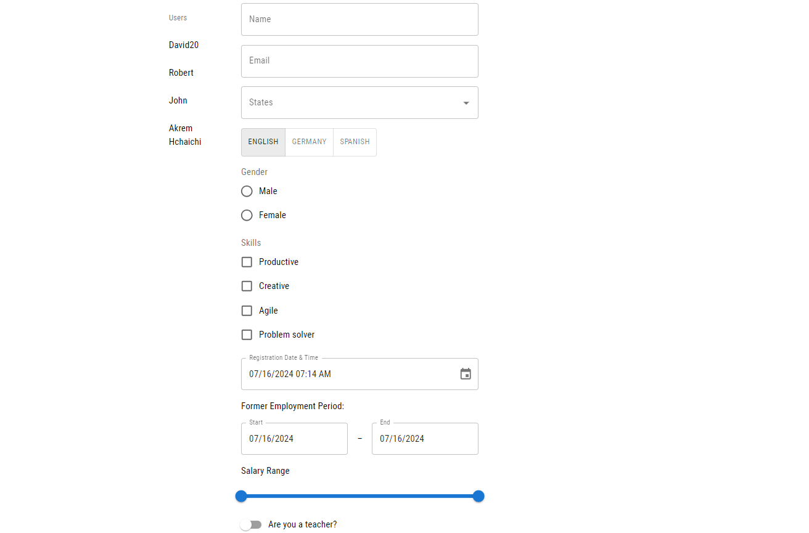

# React Hook Form Controllers for MUI Components and Zod Schema

This project almost contains all possible combinations with React Hook Form, Material UI and Zod (discriminated unions with Zod and React Hook Form and MUI, customized controller and so much more).

<h2>Project Screenshots:</h2>



<h2>🛠️ Installation Steps:</h2>

<p>1. clone project</p>

```
https://github.com/akrem-hchaichi/react-hook-form-mui-zod.git
```

<p>2. Run the backend</p>

```
cd backend
npm install
npm run dev
```

<p>3. Run the frontend</p>

```
cd frontend
npm install
npm run start
```

<h2>💻 Built with</h2>

Technologies used in the project:

- React
- TypeScript
- React Form Hook
- Material-UI
- Zod
- Node.js
